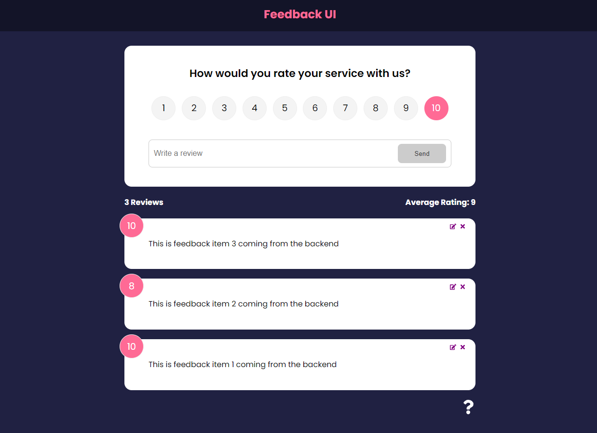

# React-Feedback-App

<p align="center">

</p>

# Features

- [x] Fullstack App Built in React 18
- [x] REST API creation
- [x] Components, Props, Hooks, State
- [x] React hooks such as useState, useEffect, useContext, useReducer, useRef,
- [x] React Router 6
- [x] Global State Management with context, reducers and hooks
- [x] Deployment to Netlify
- [x] JSON Server used for Mock Dataabase

# Packages used

```
├── @testing-library/jest-dom@5.16.4
├── @testing-library/react@13.3.0
├── @testing-library/user-event@14.2.0
├── concurrently@7.2.1
├── framer-motion@6.3.11
├── json-server@0.17.0
├── react-dom@18.1.0
├── react-icons@4.3.1
├── react-router-dom@6.3.0
├── react-scripts@5.0.0
├── react@18.1.0
├── serve@13.0.2
├── uuid@8.3.2
└── web-vitals@2.1.4
```

# Instructions

To run this project locally:

- Clone the repo
- Run `npm install`
- Concurrently — (NPM Package) is used to run both the backend server and frontend so therefore; start the application with:
  - `npm run dev` : Start Application

# Build Instructions

> The following instructions will create an optimized production build in a folder called Build.

- Use [serve](https://www.npmjs.com/package/serve)
- `npm run build` : Build Production
- `serve -s build` : Serve Production build
